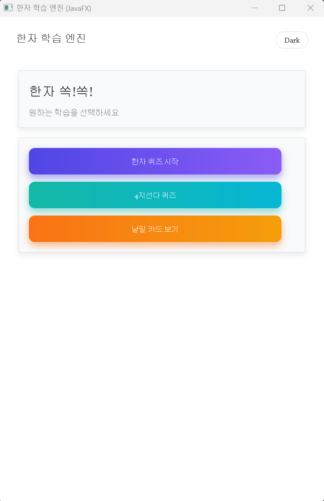
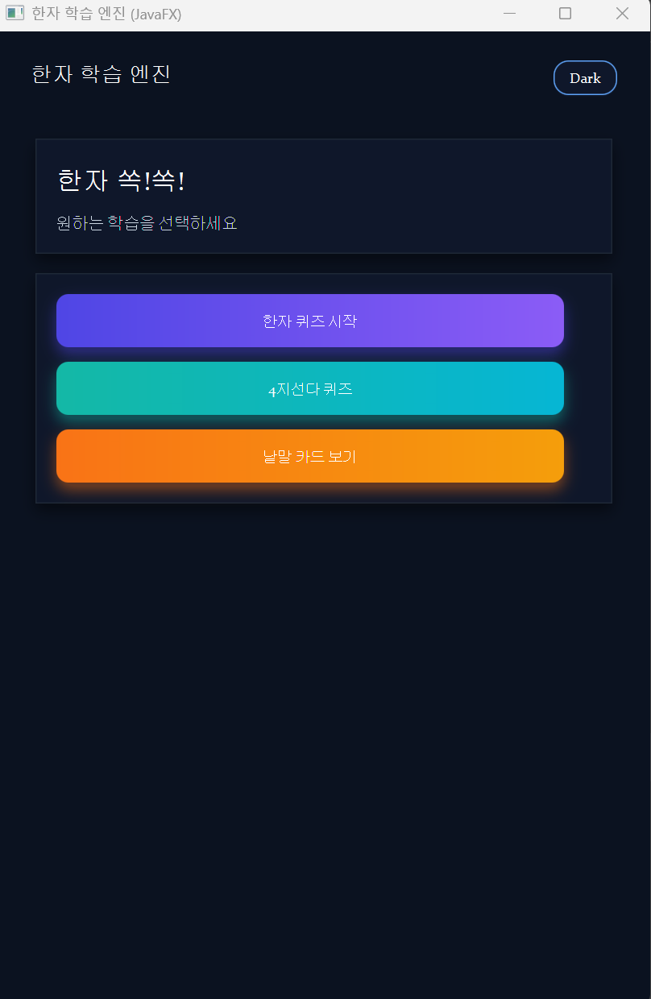
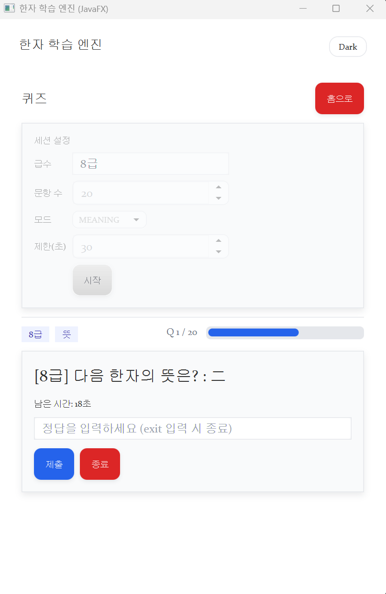
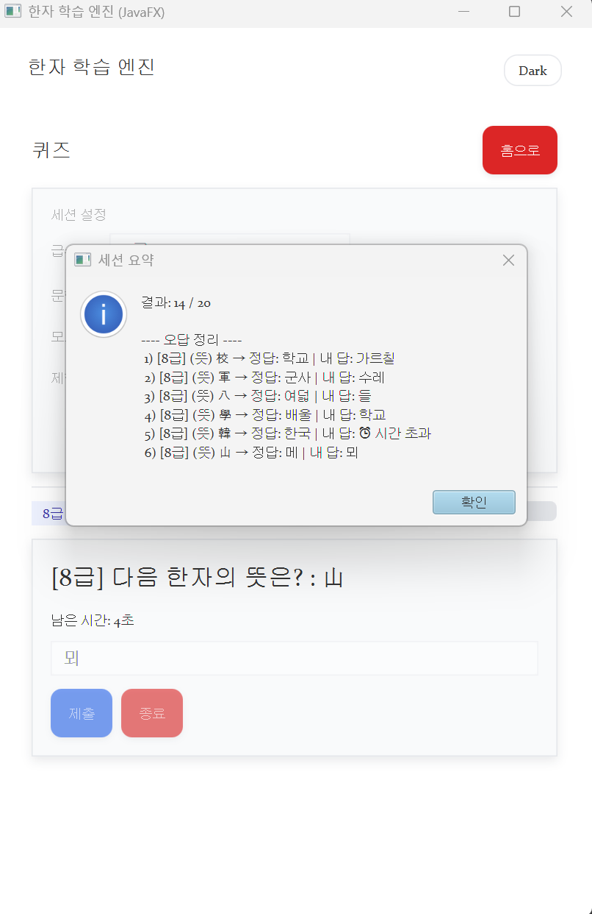
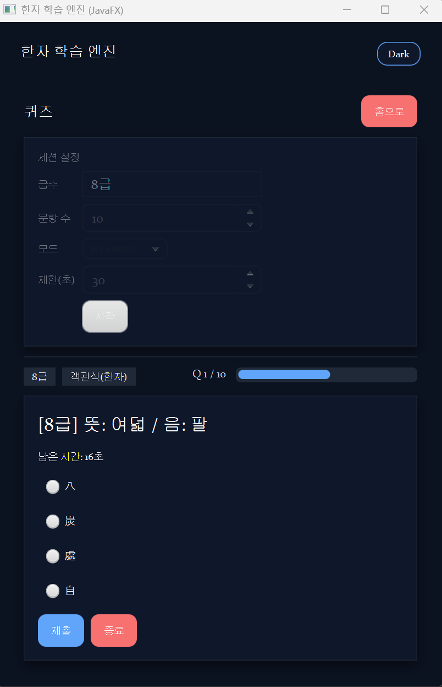
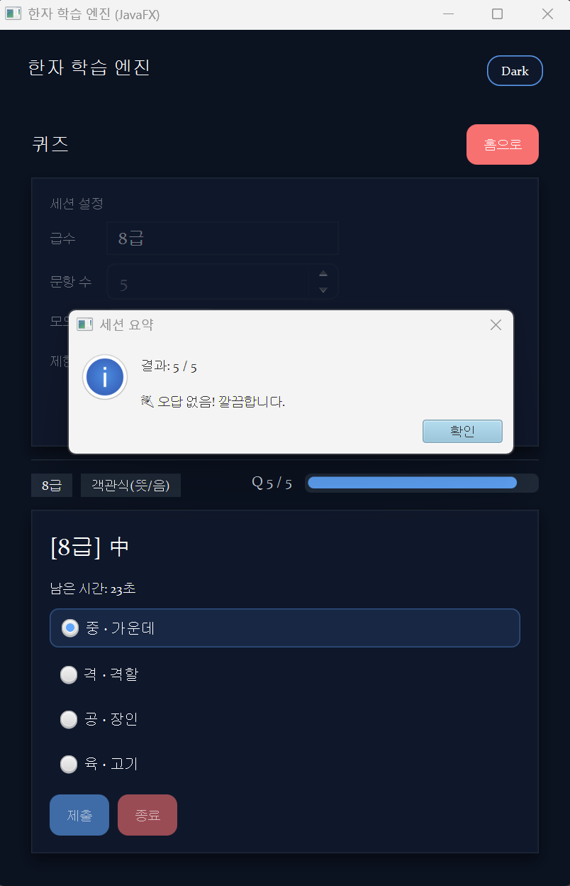
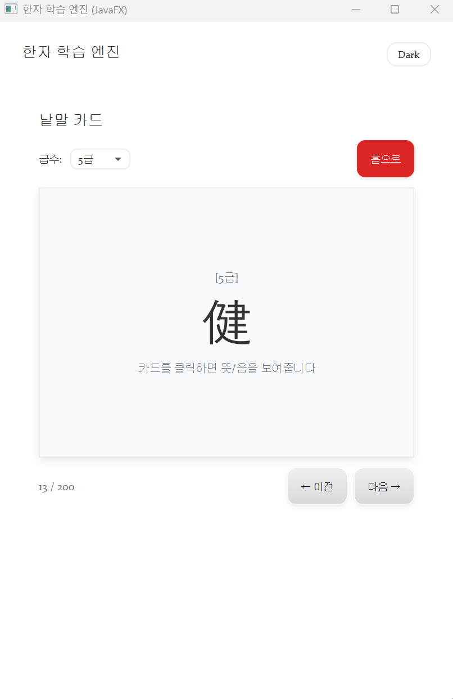
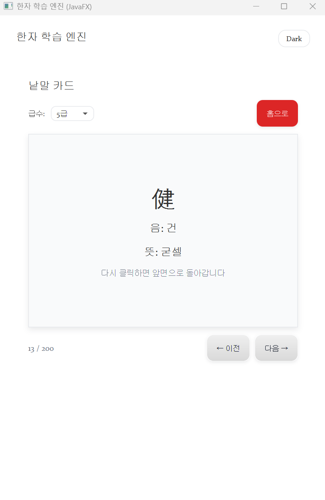

# 한자 학습 엔진

자바로 구현하는 한자 학습 엔진.

- 한자 JSON 로드 → 문제 생성(뜻/음/섞기)
- 4지선다(MCQ) 퀴즈(텍스트↔한자)
- 30초 카운트다운 타이머 + exit로 중도 종료
- 세션 종료 시 오답 요약 일괄 출력
- 출제 규칙은 전략(Strategy)으로 교체 가능
- Consol 실행 또는 JavaFX GUI + 다크/라이트 모드 지원

## 기능 목록
- 데이터
    - [x] `src/main/resources/hanja-data.json`에서 한자 목록 로드
    - [x] `Hanja`, `HanjaRepository`, `JsonHanjaRepository` 구현
- 퀴즈
    - [x] `QuestionType`(HANJA_TO_MEANING / MEANING_TO_HANJA / HANJA_TO_READING)
    - [x] `Quiz`(문제 텍스트/채점)
    - [x] `QuizStrategy` 인터페이스 + `RandomQuizStrategy`
    - [x] `MistakeFirstStrategy` (오답 우선 출제)
    - [x] 제한 시간(기본 30초) 진행바/남은 시간 표시
    - [x] `exit` 입력 시 즉시 종료
    - [x] 퀴즈 종료 시 오답 요약 팝업/출력
    - [x] 4지선다(MCQ): McqQuizFactory를 통해 텍스트→한자 / 한자→텍스트
- 학습 진행
    - [x] `LearningRecord`, `UserProgress`(정답/오답 기록, 재출제 여부 판정)
    - [x] `StudyService`
- 저장(영속)
    - [x] `ProgressRepository` 인터페이스
    - [x] `FileProgressRepository`(JSON/텍스트 저장)
- UI(콘솔)
    - [x] 인터랙티브 시작 프롬프트: 급수(복수 선택)/문항 수/모드(뜻·음·섞기)
    - [x] 문제당 30초 타이머 + 카운트다운 표시
    - [x] `exit` 입력 시 즉시 종료
-GUI(JavaFX)
    - [x] 제목/설명 카드와 선택 버튼 카드 두 섹션으로 분리
    - [x] 급수 드롭다운으로 필터
    - [x] 카드 클릭 시 앞/뒷면 플립 애니메이션
    - [x] 4지선다(MCQ) 라디오 버튼 UI + 자동 오답 보기 생성
    - [x] 이전, 다음 버튼 양 끝에서 순환 이동
- 테스트
    - [x] `JsonHanjaRepository` 로딩 테스트
    - [x] `UserProgress.recordResult / needsReview` 테스트
    - [x] `RandomQuizStrategy` 기본 동작 테스트
    - [x] `MistakeFirstStrategy` 오답 우선

---

## 프로그래밍 요구 사항
- [x] 기능을 구현하기 전 **README.md에 구현할 기능 목록**을 정리해 추가한다.
- [x] **커밋 단위**는 README의 기능 목록 단위로 쪼갠다.
- [x] **JDK 21**에서 실행 가능해야 한다. (Gradle toolchain으로 고정)
- [x] **JUnit 5 + AssertJ**로 기능 테스트 검증

---

## 디렉터리 구조 
    hanja
    ├─ domain/    (Hanja, HanjaRepository, JsonHanjaRepository)
    ├─ quiz/      (Quiz, QuestionType, QuizStrategy, RandomQuizStrategy, McqQuizFactory, MistakeFirstStrategy)
    ├─ study/     (LearningRecord, UserProgress, StudyService)
    ├─ storage/   (ProgressRepository, FileProgressRepository)
    ├─ util/      (AnswerNormalizer, AsyncLineReader, TimedPrompt)                  // 입력/카운트다운 유틸
    └─ ui/
        ├─ ConsoleApp.java                                         // 오케스트레이션
        ├─ ConsolePrompter.java                                    // 초기 프롬프트
        ├─ config/  (SessionConfig)                                // 세션 설정 값
        ├─ session/ (SessionRunner, Attempt, SessionResult)        // 세션 실행/결과
        └─ view/    (ReviewPrinter)                                // 오답 요약 출력
    └─ gui/
        └─ HanjaFXApp.java                                    // JavaFX GUI
    resources/
    └─ ui/styles.css                                         // GUI 스타일/다크 모드
---

## 데이터 포맷 (JSON)
src/main/resources/hanja-data.json

    [
    { "character": "一", "reading": "일", "meaning": "하나", "level": "8급" },
    { "character": "二", "reading": "이", "meaning": "둘",  "level": "8급" },
    { "character": "人", "reading": "인", "meaning": "사람", "level": "8급" }
    ]

    필드: character(한자), reading(독음), meaning(뜻), level(급수)

---

## 실행

방법1. GUI(JavaFX)

    ./gradlew runGui

방법2. Consol mode

    ./gradlew run

- 한글 깨짐 시 아래 코드 입력 후 실행.
  chcp 65001
  $OutputEncoding = [Console]::OutputEncoding = [System.Text.UTF8Encoding]::new()

### 흐름

1. `한자 퀴즈 시작`, `낱말 카드 보기` 중 원하는 학습 방법 선택
2. `한자 퀴즈 시작` → 급수 입력(예: 7급, 8급) → 문항수 입력 → 모드 선택(뜻,음,섞어서) → 시작 
3. `낱말 카드 보기` → 급수 선택(드롭다운) → 낱말 카드 선택 시(한자, 뜻/음 변환) → 이전,다음 버튼으로 이동

---

## 사용 방법

1. **홈 화면(라이트/다크)**

한자 학습 엔진인 `한자 쏙!쏙!`에서 세 가지 학습 방법 중 하나를 선택.

  
  

2. **한자 퀴즈 / 오답 정리**

학습하고자 하는 한자 급수와 문항 개수, 모드를 선택.

※ 급수 입력은 다음과 같은 형태로 입력 → 7급, 8급

  
  

3. **4지선다 한자 퀴즈**

한자 → 뜻/음 또는 뜻/음 → 한자 형식의 4지선다 퀴즈 학습.

  
  

4. **낱말 카드 (한자 / 뜻·음)**

학습하고자 하는 한자 급수 선택 후, 낱말 카드로 학습.

  
  

---
# 👐오픈 미션

## 목표
오픈 미션 기간동안 기획부터 개발까지 몰입하고, 개발한 엔진을 통해 학습 후 기간 내에 실제 한자 급수 자격증 취득을 목표로합니다.

## 💻 왜 한자 학습 엔진 프로젝트를 했는가?

- 2주 몰입(마이크로 스프린트)과 객체지향 연습에 정확히 들어맞는 주제라고 판단했습니다.

- 짧은 사이클, 즉각 피드백
한 문제(또는 한 장의 카드) 단위로 결과가 바로 보인다. 요구사항 쪼개기 → 구현 → 눈으로 확인하는 루프를 단축 시켜 제한된 기간 내 반복 학습/개선으로 몰입하기 좋습니다.

- 명확한 도메인과 풍부한 역할 분리
Hanja/Quiz/Attempt/Session 등의 도메인 객체와 Repository/Strategy/UI가 자연스럽게 분리된다. SRP, DIP 같은 OOP 원칙을 고려하며 몰입하여 훈련하기 좋습니다.

- 테스트 친화적 구조
타이머/입력/ 등 외부 요인을 최대한 포트/어댑터로 분리해 순수 도메인을 JUnit으로 빠르게 검증할 수 있습니다.

- UI 다양성으로 학습 폭 확장
콘솔 → JavaFX(다크 모드, 카드 플립)로 동일 도메인에 서로 다른 프레젠테이션을 입혀보며 레이어드 아키텍처를 체득합니다.

- 데이터 주도 실험
JSON 데이터로 범위를 조정할 수 있어 2주 동안 실험-관찰-개선 루프를 꾸준히 돌리기에 적합했습니다.

## ❓시도와 학습의 흔적을 남긴 이유
레포지토리에는 현재 화면 흐름에 바로 연결되지 않는 코드도 남겼습니다. 
예를 들어 UserProgress,LearningRecord는 정답/오답 이력과 재출제 판단을 담당하며, 콘솔 러너와 결합해 오답 우선 출제와 같은 전략을 실험할 수 있었습니다. 
GUI를 만들면서는 시각적 피드백을 우선했고, 학습 이력 기반 개인화를 어떻게 녹일지 여러 설계를 검토했고, 이 실험 지점들을 의도적으로 보존했습니다. 
당장 사용하지 않더라도 다음 단계에서 카드 학습과 자연스럽게 접목할 수 있는 확장 포인트라고 생각했기 때문입니다. 
단, 혼란을 막기 위해 README에 “현재 실행에서는 직접 노출되지 않지만 다음 확장에서 사용할 수 있는 가능성”이라고 명확히 밝혀 두고자 합니다. 
이런 방식으로 죽은 코드는 제거하고, 학습 가치가 있는 흔적은 맥락을 붙여 보관함으로써 유지보수성과 확장성을 함께 챙기려 했습니다.